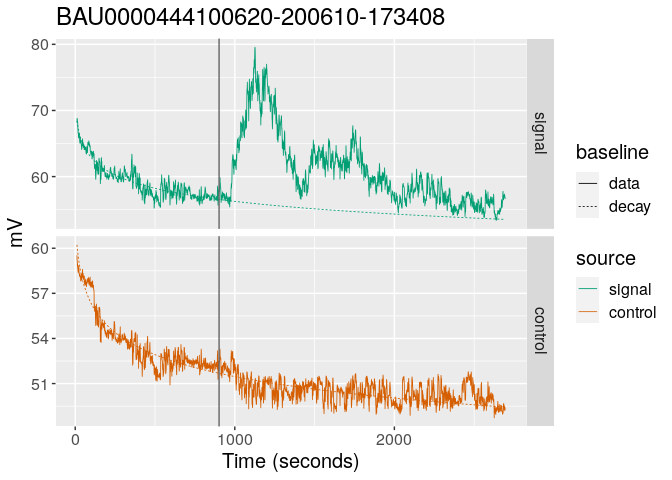
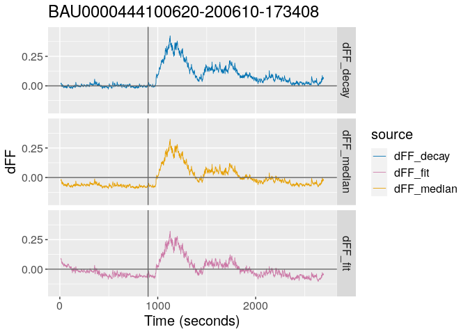

<!-- README.md is generated from README.Rmd. Please edit that file -->

# fibeR

<!-- badges: start -->
<!-- badges: end -->

Fiber photometry processing and data analysis

## Installation

Install fibeR using:

``` r
devtools::install_github("lsteuernagel/fibeR")
```

Check whether fibeR can be loaded:

``` r
library(fibeR)
```

## Quick start (one sample)

``` r
sample_path =   "/beegfs/v0/labnet-data/calcium/cbauder/BAU0000444100620-200610-173408/" # add your own path
fiber_sample = import_fibeR(input_path = sample_path,verbose =FALSE)
fiber_sample = process_fibeR(fiber_sample,start_note = 2,correct_with_control=TRUE,verbose =FALSE) # specify the intervention note, typically 2 (1 being the start of recording)
plot_fibeR(fiber_sample,datatype = "decay") # use 'raw' to get raw data plot
```


## Quick start (multiple samples)

## Example with one sample

In the readme we are only highlighting the basic usage and the most
important parameters. You can always type ?function (e.g. ?process_fibeR
to read about more parameters etc.)

### Import a TDT sample

Import an example fiber sample by specifying the path to the folder
containing the .tbk files from TDT:

Notes: - In this example I am loading a file from the beegfs because the
TDT file are too large to include examples in the package). You can
change sample path to your own samples. - To compile the example I am
loading from an existing (cached) file. When running this yourself for
the first time (for each sample), it will run Matlab.

``` r
sample_path =  "/beegfs/v0/labnet-data/calcium/cbauder/BAU0000444100620-200610-173408/"
fiber_sample = import_fibeR(input_path = sample_path)
#> import_fibeR: Using last subfolder as id: BAU0000444100620-200610-173408
#> export_tdt: Found existing export file for this id in outputpath. Not running Matlab. Set return_cached to FALSE to overwrite this behavior.
#> export_Notes: Exporting notes
#> Warning: Id in notes differs from expected id
```

The result is an fibeR_data object (essentially an R list) with the data
and id:

``` r
str(fiber_sample)
#> List of 4
#>  $ id          : chr "BAU0000444100620-200610-173408"
#>  $ raw.data    :'data.frame':    2749 obs. of  3 variables:
#>   ..$ time : num [1:2749] 0.000983 0.984023 1.967063 2.950103 3.933143 ...
#>   ..$ x465A: num [1:2749] 64.8 75 74.2 73.7 72.6 ...
#>   ..$ x405A: num [1:2749] 53.9 62 61.6 61.5 61.1 ...
#>  $ process.data: NULL
#>  $ notes       :'data.frame':    4 obs. of  4 variables:
#>   ..$ note_id  : int [1:4] 1 2 3 4
#>   ..$ note_date: POSIXct[1:4], format: "2020-06-10 15:34:11" "2020-06-10 15:49:12" ...
#>   ..$ text     : chr [1:4] "start" "add caged food" "end food" "stop"
#>   ..$ note_time: int [1:4] 0 901 981 2704
#>  - attr(*, "class")= chr "fibeR_data"
```

### Import a TDT sample

We can then process the sample. This mostly includes calculation of dFF.
For most dFF calculations we require an intervention time point to
calculate the baseline on the pre-intervention data

The most important parameters: - cutoff_start: how many seconds to cut
of at start - cutoff_end: how many seconds to cut of at end -
**start_note**: which note tells process_fibeR when the intervention
happened. Iif you have not taken notes in the system, you can specify
the second with the ‘intervention_second_fallback’ parameter. If you
want to include all data into the baseline calculation set it to “stop”
which should be the last note that specifies the end of the recording
(automatically included by TDT). - **correct_with_control**: whether to
subtract the control when calculating the final dFF

``` r
fiber_sample = process_fibeR(fiber_sample,
                             cutoff_start = 10,
                             cutoff_end = 5,
                             start_note = 2,
                             correct_with_control=TRUE,
                             verbose =TRUE)
#> Processing fibeR_input...
#> Removing 46 data points to reduce the data to one point per (rounded) second. Set reduce_for_comparability to FALSE to disable this behavior.
#> dFF: Estimate median
#> dFF: Fitting control to signal
#> dFF: Estimate exponetial decay
#> Processing complete.
```

How did the sample change:

``` r
str(fiber_sample)
#> List of 6
#>  $ id                  : chr "BAU0000444100620-200610-173408"
#>  $ raw.data            :'data.frame':    2749 obs. of  3 variables:
#>   ..$ time : num [1:2749] 0.000983 0.984023 1.967063 2.950103 3.933143 ...
#>   ..$ x465A: num [1:2749] 64.8 75 74.2 73.7 72.6 ...
#>   ..$ x405A: num [1:2749] 53.9 62 61.6 61.5 61.1 ...
#>  $ process.data        :'data.frame':    2686 obs. of  7 variables:
#>   ..$ time                  : num [1:2686] 10.8 11.8 12.8 13.8 14.7 ...
#>   ..$ time_from_intervention: num [1:2686] -891 -890 -889 -888 -887 -886 -885 -884 -883 -882 ...
#>   ..$ x465A                 : num [1:2686] 68.8 68.2 68.8 68.2 68.3 ...
#>   ..$ x405A                 : num [1:2686] 59.5 59.2 59.2 58.8 59 ...
#>   ..$ dFF_median            : num [1:2686] -0.0227 -0.0255 -0.0157 -0.019 -0.0202 ...
#>   ..$ dFF_fit               : num [1:2686] 0.0899 0.0831 0.0919 0.0842 0.0851 ...
#>   ..$ dFF_decay             : num [1:2686] 0.0171 0.015 0.0241 0.0214 0.021 ...
#>  $ notes               :'data.frame':    4 obs. of  4 variables:
#>   ..$ note_id  : int [1:4] 1 2 3 4
#>   ..$ note_date: POSIXct[1:4], format: "2020-06-10 15:34:11" "2020-06-10 15:49:12" ...
#>   ..$ text     : chr [1:4] "start" "add caged food" "end food" "stop"
#>   ..$ note_time: int [1:4] 0 901 981 2704
#>  $ intervention_seconds: int 901
#>  $ baseline.data       :'data.frame':    2686 obs. of  7 variables:
#>   ..$ time                  : num [1:2686] 10.8 11.8 12.8 13.8 14.7 ...
#>   ..$ time_from_intervention: num [1:2686] -891 -890 -889 -888 -887 -886 -885 -884 -883 -882 ...
#>   ..$ median_signal         : num [1:2686] 59.4 59.4 59.4 59.4 59.4 ...
#>   ..$ median_control        : num [1:2686] 50.4 50.4 50.4 50.4 50.4 ...
#>   ..$ fit_control           : num [1:2686] 63.1 63 63 62.9 62.9 ...
#>   ..$ decay_signal          : num [1:2686] 68.4 68.3 68.1 68 67.8 ...
#>   ..$ decay_control         : num [1:2686] 60.2 60.1 60 59.9 59.8 ...
#>  - attr(*, "class")= chr "fibeR_data"
```

The processing function added the processed data (and also baseline
information) to the fibeR_data object.

### Plot the results

We can use the plot_fibeR function to plot the content of the fibeR_data
object

#### Raw data

First we plot the raw input ( we could also do this before the
processing, but then we cannot include the baseline into this plot)

The two most important parameters are: - **datatype**: We set this to
‘raw’ to get the signal and control - **split_plots**: If TRUE signal
and control are plotted in two facets.

``` r
plot_fibeR(fiber_sample,datatype = "raw",split_plots = TRUE)
```


\#### Raw data

Then we can plot the processed (and normalized) dFF signal.

For this we set **datatype** to “decay” which means we will plot the
data normalized by subtracting and dividing by a baseline based on a
negative exponential decay that was fitted to the pre-intervention data.
Alternatives are ‘median’ (median of baseline) or ‘fit’ (Lerner method).

``` r
plot_fibeR(fiber_sample,datatype = "decay")
```


### Save the results

We can export the fibeR_data object into easily readable flat table
files using the save function.

**Change example path (just a temporary path for this readme) to a path
in your own directory !**

``` r
example_path = paste0(tempdir(),"/")
save_fibeR(fiber_sample, output_path = example_path)
```

#### Re-load data

load_fibeR allows to re-assemble a fibeR_data object from the exported
files. This saves us re-exporting (from matlab) and re-processing. This
function requires the id of the sample (which be default is the folder
name).

``` r
id_to_load = "BAU0000444100620-200610-173408"
newly_loaded = load_fibeR(id=id_to_load,input_path = example_path)
names(newly_loaded)
#> [1] "id"            "baseline.data" "notes"         "process.data" 
#> [5] "raw.data"
```

## Multiple Samples (batch)

To be added

## Details on Matlab and caching

Will be extended in the future.

Most importantly: You can change the outputpath of import_fibeR to a
permanent location in your beegfs/scratch or home directoy to save the
Matlab exports permanently which decreases load times when working
repeatedly with samples!

## Details on Visualization

Will be extended in the future.

For example: You can visualize multiple processing approaches in
individual facets:

``` r
plot_fibeR(fiber_sample,datatype = c("decay","median","fit"),split_plots = TRUE)
```


