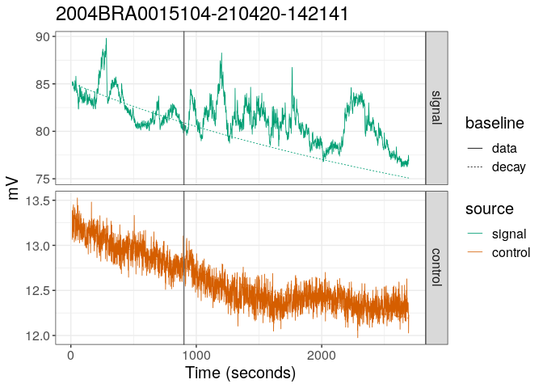
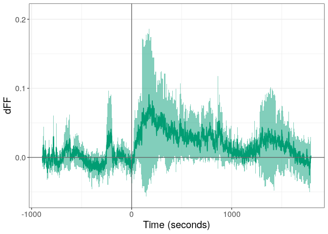

<!-- README.md is generated from README.Rmd. Please edit that file -->

# fibeR

<!-- badges: start -->
<!-- badges: end -->

Fiber photometry processing and data analysis

# Installation

Install fibeR using:

``` r
devtools::install_github("lsteuernagel/fibeR")
```

Check whether fibeR can be loaded:

``` r
library(fibeR)
```

# Quick start (one sample)

``` r
sample_path =   "/beegfs/v0/labnet-data/calcium/cbauder/BAU0000444100620-200610-173408/" # add your own path
fiber_sample = import_fibeR(input_path = sample_path,verbose =FALSE)
fiber_sample = process_fibeR(fiber_sample,start_note = 2,correct_with_control=TRUE,verbose =FALSE) # specify the intervention note, typically 2 (1 being the start of recording)
plot_fibeR(fiber_sample,datatype = "decay") # use 'raw' to get raw data plot
```


# Quick start (multiple samples)

The ’\_batch’ functions allow running the import and processing on a
folder with many samples (that can be organized in various subfolders).
Depending on the number of samples this can take a while (\~10 sec per
sample).

It is recommended to specify an output folder
(‘batch_sample_output_path’), then re-importing or loading data is much
faster in the next session (because Matlab and downsampling are
skipped).

``` r
batch_sample_path =   "/beegfs/v0/labnet-data/calcium/cbauder/2020_07_09/" # add your own path
batch_sample_output_path = "/beegfs/scratch/bruening_scratch/lsteuernagel/data/fiberPhotometry/testexport/readme/" # change to your own path on scratch
fiber_sample_list = import_fibeR_batch(batch_path = batch_sample_path,batch_output_path = batch_sample_output_path,showProgress = FALSE) # set showProgress = TRUE !
fiber_sample_list = process_fibeR_batch(fiber_sample_list,start_note_all = 2,showProgress = FALSE) # specify the intervention note, typically 2 (1 being the start of recording)
save_fibeR_batch(fiber_sample_list,batch_output_path = batch_sample_output_path,showProgress = FALSE) # save processed result to same path
names(fiber_sample_list) ## access list elements like this : fiber_sample_list[[1]] or fiber_sample_list[["090720BRA0012161-200709-141509"]]
#> [1] "090720BRA0000517-200709-132227" "090720BRA0010685-200709-161148"
#> [3] "090720BRA0012142-200709-152204" "090720BRA0012161-200709-141509"
```

# Example with one sample

In the readme we are only highlighting the basic usage and the most
important parameters. You can always type ?function (e.g. ?process_fibeR
to read about more parameters etc.)

## Import a TDT sample

Import an example fiber sample by specifying the path to the folder
containing the .tbk files from TDT:

Notes: - In this example I am loading a file from the beegfs because the
TDT file are too large to include examples in the package). You can
change sample path to your own samples. - To compile the example I am
loading from an existing (cached) file. When running this yourself for
the first time (for each sample), it will run Matlab.

``` r
sample_path =  "/beegfs/v0/labnet-data/calcium/cbauder/BAU0000444100620-200610-173408/"
fiber_sample = import_fibeR(input_path = sample_path)
#> import_fibeR: Using last subfolder as id: BAU0000444100620-200610-173408
#> export_tdt: Found existing export file for this id in outputpath. Not running Matlab. Set return_cached to FALSE to overwrite this behavior.
#> export_Notes: Exporting notes
#> Warning: Id in notes differs from expected id
```

The result is an fibeR_data object (essentially an R list) with the data
and id:

``` r
str(fiber_sample)
#> List of 4
#>  $ id          : chr "BAU0000444100620-200610-173408"
#>  $ raw.data    :'data.frame':    2749 obs. of  3 variables:
#>   ..$ time : num [1:2749] 0.000983 0.984023 1.967063 2.950103 3.933143 ...
#>   ..$ x465A: num [1:2749] 64.8 75 74.2 73.7 72.6 ...
#>   ..$ x405A: num [1:2749] 53.9 62 61.6 61.5 61.1 ...
#>  $ process.data: NULL
#>  $ notes       :'data.frame':    4 obs. of  4 variables:
#>   ..$ note_id  : int [1:4] 1 2 3 4
#>   ..$ note_date: POSIXct[1:4], format: "2020-06-10 15:34:11" "2020-06-10 15:49:12" ...
#>   ..$ text     : chr [1:4] "start" "add caged food" "end food" "stop"
#>   ..$ note_time: int [1:4] 0 901 981 2704
#>  - attr(*, "class")= chr "fibeR_data"
```

## Import a TDT sample

We can then process the sample. This mostly includes calculation of dFF.
For most dFF calculations we require an intervention time point to
calculate the baseline on the pre-intervention data

The most important parameters:

-   cutoff_start: how many seconds to cut of at start

-   cutoff_end: how many seconds to cut of at end

-   **start_note**: which note tells process_fibeR when the intervention
    happened. Iif you have not taken notes in the system, you can
    specify the second with the ‘intervention_second_fallback’
    parameter. If you want to include all data into the baseline
    calculation set it to “stop” which should be the last note that
    specifies the end of the recording (automatically included by TDT).

-   **correct_with_control**: whether to subtract the control when
    calculating the final dFF

``` r
fiber_sample = process_fibeR(fiber_sample,
                             cutoff_start = 10,
                             cutoff_end = 5,
                             start_note = 2,
                             correct_with_control=TRUE,
                             verbose =TRUE)
#> Processing fibeR_input...
#> dFF: Estimate median
#> dFF: Fitting control to signal
#> dFF: Estimate exponetial decay
#> Processing complete.
```

How did the sample change:

``` r
str(fiber_sample)
#> List of 6
#>  $ id                  : chr "BAU0000444100620-200610-173408"
#>  $ raw.data            :'data.frame':    2749 obs. of  3 variables:
#>   ..$ time : num [1:2749] 0.000983 0.984023 1.967063 2.950103 3.933143 ...
#>   ..$ x465A: num [1:2749] 64.8 75 74.2 73.7 72.6 ...
#>   ..$ x405A: num [1:2749] 53.9 62 61.6 61.5 61.1 ...
#>  $ process.data        :'data.frame':    2732 obs. of  7 variables:
#>   ..$ time                  : num [1:2732] 10.8 11.8 12.8 13.8 14.7 ...
#>   ..$ time_from_intervention: num [1:2732] -891 -890 -889 -888 -887 -886 -885 -884 -883 -882 ...
#>   ..$ x465A                 : num [1:2732] 68.8 68.2 68.8 68.2 68.3 ...
#>   ..$ x405A                 : num [1:2732] 59.5 59.2 59.2 58.8 59 ...
#>   ..$ dFF_median            : num [1:2732] -0.0228 -0.0256 -0.0157 -0.0191 -0.0203 ...
#>   ..$ dFF_fit               : num [1:2732] 0.0902 0.0833 0.0921 0.0844 0.0853 ...
#>   ..$ dFF_decay             : num [1:2732] 0.0173 0.0152 0.0243 0.0216 0.0212 ...
#>  $ notes               :'data.frame':    4 obs. of  4 variables:
#>   ..$ note_id  : int [1:4] 1 2 3 4
#>   ..$ note_date: POSIXct[1:4], format: "2020-06-10 15:34:11" "2020-06-10 15:49:12" ...
#>   ..$ text     : chr [1:4] "start" "add caged food" "end food" "stop"
#>   ..$ note_time: int [1:4] 0 901 981 2704
#>  $ intervention_seconds: int 901
#>  $ baseline.data       :'data.frame':    2732 obs. of  7 variables:
#>   ..$ time                  : num [1:2732] 10.8 11.8 12.8 13.8 14.7 ...
#>   ..$ time_from_intervention: num [1:2732] -891 -890 -889 -888 -887 -886 -885 -884 -883 -882 ...
#>   ..$ median_signal         : num [1:2732] 59.4 59.4 59.4 59.4 59.4 ...
#>   ..$ median_control        : num [1:2732] 50.4 50.4 50.4 50.4 50.4 ...
#>   ..$ fit_control           : num [1:2732] 63.1 63 63 62.9 62.9 ...
#>   ..$ decay_signal          : num [1:2732] 68.4 68.2 68.1 67.9 67.8 ...
#>   ..$ decay_control         : num [1:2732] 60.2 60.1 60 59.9 59.8 ...
#>  - attr(*, "class")= chr "fibeR_data"
```

The processing function added the processed data (and also baseline
information) to the fibeR_data object.

## Plot the results

We can use the plot_fibeR function to plot the content of the fibeR_data
object

### Raw data

First we plot the raw input ( we could also do this before the
processing, but then we cannot include the baseline into this plot)

The two most important parameters are: - **datatype**: We set this to
‘raw’ to get the signal and control - **split_plots**: If TRUE signal
and control are plotted in two facets.

``` r
plot_fibeR(fiber_sample,datatype = "raw",split_plots = TRUE)
```


### Processed data

Then we can plot the processed (and normalized) dFF signal.

For this we set **datatype** to “decay” which means we will plot the
data normalized by subtracting and dividing by a baseline based on a
negative exponential decay that was fitted to the pre-intervention data.
Alternatives are ‘median’ (median of baseline) or ‘fit’ (Lerner method).

``` r
plot_fibeR(fiber_sample,datatype = "decay")
```


## Save the results

We can export the fibeR_data object into easily readable flat table
files using the save function.

**Change example path (just a temporary path for this readme) to a path
in your own directory !**

``` r
example_path = paste0(tempdir(),"/")
save_fibeR(fiber_sample, output_path = example_path)
```

### Re-load data

load_fibeR allows to re-assemble a fibeR_data object from the exported
files. This saves us re-exporting (from matlab) and re-processing. This
function requires the id of the sample (which be default is the folder
name).

``` r
id_to_load = "BAU0000444100620-200610-173408"
newly_loaded = load_fibeR(id=id_to_load,input_path = example_path)
names(newly_loaded)
#> [1] "id"            "baseline.data" "notes"         "process.data" 
#> [5] "raw.data"
```

# Multiple Samples (batch)

To be extended!

The ’\_batch’ functions allow running the import and processing on a
folder with many samples (that can be organized in various subfolders).
Depending on the number of samples this can take a while (\~10 sec per
sample).

It is recommended to specify an output folder
(‘batch_sample_output_path’), then re-importing or loading data is much
faster in the next session (because Matlab and downsampling are
skipped).

## Import data

Similar to quick start:

``` r
batch_sample_path =   "/beegfs/v0/labnet-data/calcium/cbauder/2021_04_20/" # add your own path
batch_sample_output_path = "/beegfs/scratch/bruening_scratch/lsteuernagel/data/fiberPhotometry/testexport/readme/" # change to your own path on scratch
fiber_sample_list = import_fibeR_batch(batch_path = batch_sample_path,batch_output_path = batch_sample_output_path)
#>   |                                                                              |                                                                      |   0%  |                                                                              |=======================                                               |  33%  |                                                                              |===============================================                       |  67%  |                                                                              |======================================================================| 100%
```

## Process data

``` r
fiber_sample_list = process_fibeR_batch(fiber_sample_list,start_note_all = 2) # specify the intervention note, typically 2 (1 being the start of recording)
#>   |                                                                              |                                                                      |   0%  |                                                                              |=======================                                               |  33%  |                                                                              |===============================================                       |  67%  |                                                                              |======================================================================| 100%
names(fiber_sample_list) ## access list elements like this : fiber_sample_list[[1]] or fiber_sample_list[["090720BRA0012161-200709-141509"]]
#> [1] "2004BRA0015099-210420-120430" "2004BRA0015100-210420-130517"
#> [3] "2004BRA0015104-210420-142141"
```

## Access individual samples

We can subset the list to individual samples by index or sample_id and
then work with those using the functions shown in the above section
‘Example with one sample’

``` r
single_sample = fiber_sample_list[["2004BRA0015104-210420-142141"]]
str(single_sample)
#> List of 7
#>  $ id                  : chr "2004BRA0015104-210420-142141"
#>  $ raw.data            :'data.frame':    2748 obs. of  3 variables:
#>   ..$ time : num [1:2748] 0.000983 0.984023 1.967063 2.950103 3.933143 ...
#>   ..$ x465A: num [1:2748] 70.9 85.8 85.1 85.3 85.1 ...
#>   ..$ x405A: num [1:2748] 11.5 13.4 13.3 13.4 13.2 ...
#>  $ process.data        :'data.frame':    2731 obs. of  7 variables:
#>   ..$ time                  : num [1:2731] 10.8 11.8 12.8 13.8 14.7 ...
#>   ..$ time_from_intervention: num [1:2731] -891 -890 -889 -888 -887 -886 -885 -884 -883 -882 ...
#>   ..$ x465A                 : num [1:2731] 85.2 85.1 84.8 85 85.2 ...
#>   ..$ x405A                 : num [1:2731] 13.1 13.4 13.3 13.2 13.3 ...
#>   ..$ dFF_median            : num [1:2731] 0.00415 -0.02356 -0.01693 -0.01267 -0.01625 ...
#>   ..$ dFF_fit               : num [1:2731] 0.02481 0.00742 0.01012 0.01347 0.01222 ...
#>   ..$ dFF_decay             : num [1:2731] 0.01458 -0.01142 -0.00522 -0.0012 -0.00452 ...
#>  $ notes               :'data.frame':    4 obs. of  4 variables:
#>   ..$ note_id  : int [1:4] 1 2 3 4
#>   ..$ note_date: POSIXct[1:4], format: "2021-04-20 12:21:43" "2021-04-20 12:36:44" ...
#>   ..$ text     : chr [1:4] "start" "start food" "end food" "stop"
#>   ..$ note_time: int [1:4] 0 901 924 2703
#>  $ folder_name         : Named chr "2004BRA0015104-210420-142141"
#>   ..- attr(*, "names")= chr "/beegfs/v0/labnet-data/calcium/cbauder/2021_04_20//2004BRA0015104-210420-142141/Exp_corinna-200528-115116_2004B"| __truncated__
#>  $ intervention_seconds: int 901
#>  $ baseline.data       :'data.frame':    2731 obs. of  7 variables:
#>   ..$ time                  : num [1:2731] 10.8 11.8 12.8 13.8 14.7 ...
#>   ..$ time_from_intervention: num [1:2731] -891 -890 -889 -888 -887 -886 -885 -884 -883 -882 ...
#>   ..$ median_signal         : num [1:2731] 80.6 80.6 80.6 80.6 80.6 ...
#>   ..$ median_control        : num [1:2731] 12.4 12.4 12.4 12.4 12.4 ...
#>   ..$ fit_control           : num [1:2731] 83.2 84.5 84 83.8 84.2 ...
#>   ..$ decay_signal          : num [1:2731] 85.1 85.1 85.1 85.1 85 ...
#>   ..$ decay_control         : num [1:2731] 13.2 13.2 13.2 13.2 13.2 ...
#>  - attr(*, "class")= chr "fibeR_data"
```

We can also plot this sample:

``` r
plot_fibeR(fiber_sample_list[["2004BRA0015104-210420-142141"]],datatype = "raw",split_plots = TRUE)
```



Which happens to look a bit weird with the control and signal differing
mostly.

## Plot all samples

### Align samples

Until now we hav treated each sample individually- The \_batch functions
allow convenient loading and processing but ultimately also just iterate
over samples.

To plot data together we need to align them to the same timeline. Part
of this is already done during processing by adding the column
‘time_from_intervention’ and now we use the function align_fibeR makes
to gather multiple samples in one matrix.

``` r
aligned_dFF = align_fibeR(fiber_sample_list, columns_to_align = c("decay"))
dim(aligned_dFF)
#> [1] 2685    3
```

If we specify multiple ‘columns_to_align’ (out of (‘signal’, ‘control’,
‘decay’, ‘median’, ‘fit’)) the function does not return one matrix (or
data.frame) but a list of multiple.

### Plot multiple samples together (lines)

We can now show multiple samples together in one line plot.

``` r
suppressWarnings(print(plot_aligned_fibeR(aligned_dFF))) # calling plot_aligned_fibeR(aligned_dFF) is enough
```


### Adding mean and variance (lines)

It might also be desirable to plot the mean and standard deviation
(especially in real world scenarios with more than 3 samples).

We can set summary_stat = TRUE to plot only the mean and sd:

``` r
suppressWarnings(print(plot_aligned_fibeR(aligned_dFF,summary_stat = TRUE))) # calling plot_aligned_fibeR(aligned_dFF,summary_stat = TRUE) is enough
```



### Plotting samples as a heatmap

TODO: heatmap !

``` r
suppressWarnings(suppressMessages(print(plot_heat_aligned_fibeR(aligned_dFF)))) # calling plot_heat_aligned_fibeR(aligned_dFF) is enough
```


### Multiple conditions & List subsetting

Currently fibeR does not support handling data conditions.

To make plot similar to the ones above yourself, you can import data
into different sample-lists by calling import_fibeR_batch or
load_fibeR_batch on different folders. Or, if you have loaded everything
into one big list, you can subset that list into multiple subsets and
then align and plot these individually!

### Exporting data

The resulting data.frames can be exported by any standard R write
function like ‘write.table’. here we are using data.table::fwrite()

``` r
batch_sample_output_path = "/beegfs/scratch/bruening_scratch/lsteuernagel/data/fiberPhotometry/testexport/readme/"
data.table::fwrite(aligned_dFF,paste0(batch_sample_output_path,"aligned_dFF_example.csv"))
```

## Save & load data

Similar to the section ‘Example with one sample’ we can save and load
the results. With many samples, this saves time processing the data.

``` r
save_fibeR_batch(fiber_sample_list,batch_output_path = batch_sample_output_path) # save processed result to same path
#>   |                                                                              |                                                                      |   0%  |                                                                              |=======================                                               |  33%  |                                                                              |===============================================                       |  67%  |                                                                              |======================================================================| 100%
```

TODO: load !

``` r
# TODO
```

# Details on Matlab and caching

Will be extended in the future.

Most importantly: You can change the outputpath of import_fibeR to a
permanent location in your beegfs/scratch or home directoy to save the
Matlab exports permanently which decreases load times when working
repeatedly with samples!

# Details on Visualization

Will be extended in the future.

For example: You can visualize multiple processing approaches in
individual facets:

``` r
plot_fibeR(fiber_sample,datatype = c("decay","median","fit"),split_plots = TRUE)
```


